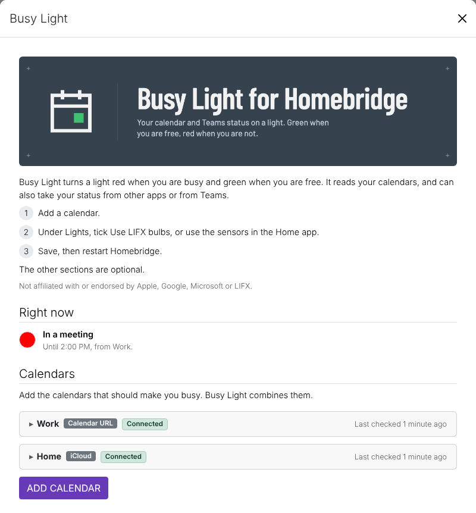
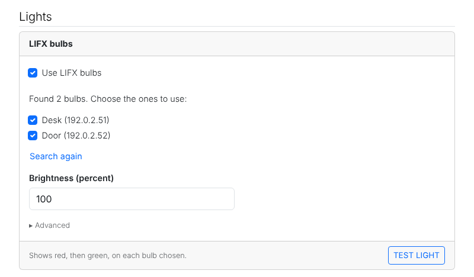

<!--
verified-by-homebridge: this plugin has not been through Homebridge verification yet.
Do not claim it. Once the plugin is verified, replace this comment with the badge:
[](https://github.com/homebridge/homebridge/wiki/Verified-Plugins)
-->

[](https://www.npmjs.com/package/homebridge-busy-light)
[](https://www.npmjs.com/package/homebridge-busy-light)
[](LICENSE)
[](https://github.com/arodbuilds/homebridge-busy-light/actions/workflows/build.yml)

A [Homebridge](https://homebridge.io) plugin that turns a light red when you are busy and green when you are free. It reads your calendars (iCloud, Google Calendar, Outlook or any calendar link), can also take your status from other apps or from Teams, and sets your LIFX bulbs and HomeKit sensors to match.

Not affiliated with or endorsed by Apple, Google, Microsoft or LIFX.

> **Status:** Tested on a Raspberry Pi with iCloud, an Outlook published link and two LIFX bulbs. Microsoft 365 sign-in is experimental and untested. Please report what you find in the [issue tracker](https://github.com/arodbuilds/homebridge-busy-light/issues).

## Contents

- [What it does](#what-it-does)
- [Quick start](#quick-start)
- [Statuses](#statuses)
- [Install](#install)
- [The settings page](#the-settings-page)
  - [Right now](#right-now)
  - [Calendars](#calendars)
  - [Status from other apps](#status-from-other-apps)
  - [Colors](#colors)
  - [Lights](#lights)
  - [Settings](#settings)
- [Light only during meetings](#light-only-during-meetings)
- [How often Busy Light checks](#how-often-busy-light-checks)
- [Configuration](#configuration)
- [Command line](#command-line)
- [Privacy](#privacy)
- [Known limitations](#known-limitations)
- [Troubleshooting](#troubleshooting)
- [Upgrading from 0.1.0](#upgrading-from-010)
- [Development](#development)
- [License](#license)

## What it does

Busy Light reads your calendars and reduces them to one status. Other apps on your network can report a status too, for example an app that knows you are on a call, and so can Microsoft Teams. Busy Light shows the status two ways:

1. On one or more LIFX bulbs, directly over your home network, in a color you choose for each status. Every bulb you choose shows the status together. No LIFX account or cloud is used.
2. As HomeKit occupancy sensors, so a Home automation can set any other HomeKit light or scene.

A typical use is a lamp outside a home office door: green when you are free, red in a meeting or on a call, purple when you are out of office.

It works with:

- Outlook and Microsoft 365: your calendar's published link, with no IT approval, or sign-in (experimental) for live Teams status (see [Outlook and Microsoft 365](#outlook-and-microsoft-365))
- iCloud calendars
- Google Calendar
- Any calendar subscription link that starts with `https://` or `webcal://`

Add as many calendars as you like. Busy Light combines them, and reads each one from a day back to a week ahead, so on a Friday afternoon it can say your next meeting is on Monday.

Other apps can report your status through a small API on your home network, or through an On a Call switch in the Home app. See [Status from other apps](#status-from-other-apps).

## Quick start

1. Install Busy Light from the Plugins tab of the Homebridge UI: search for the exact name `homebridge-busy-light`.
2. Open its settings and click Add calendar. For a work Outlook calendar, choose Outlook or Microsoft 365, then Published calendar link; for iCloud you need an app-specific password.
3. Under Lights, tick Use LIFX bulbs and choose your bulbs, or use the Home app sensors with any HomeKit light. A LIFX bulb is optional.
4. Click Save and restart Homebridge. Right now, at the top of the settings page, shows your status.



## Statuses

With calendars alone you will see four of these: Out of office, In a meeting, Tentative and Available (and Do not disturb while the override switch is on). The others come from Teams or from other apps that report your status.

When more than one applies, the one highest in this list wins.

| Status | Default color | When |
| --- | --- | --- |
| Out of office | Purple `#B400FF` | An out of office event is on now (including all-day ones), or Teams says you are out of office |
| Do not disturb | Red `#FF0000` | Teams is set to Do not disturb, or you are presenting or focusing, or the override switch is on |
| In a call | Red `#FF0000` | The On a Call switch is on, an app reports a call, or Teams shows you in a call |
| In a meeting | Red `#FF0000` | An event marked busy is on now, or Teams shows you in a meeting |
| Busy | Orange `#FF6A00` | Teams is set to Busy |
| Tentative | Yellow `#FFD000` | A tentative event is on now |
| Away | Yellow `#FFD000` | Teams shows you away or be right back |
| Available | Green `#00FF00` | Nothing else applies and Teams shows you available (or you do not use Teams) |
| Offline | Off | Teams shows you offline |

An app that reports your status (see [Status from other apps](#status-from-other-apps)) counts the way Teams presence does: an app reporting a call gives In a call, and so on. It cannot hide a higher status: an app reporting Available does not hide a meeting in your calendar.

All-day events marked busy or tentative are ignored by default, so a reminder that fills the whole day does not keep the light red. All-day out of office events always count.

Calendars have no out of office setting of their own, so for iCloud, Google and calendar links an event counts as out of office when its title contains one of the out of office words (by default: Out of office, OOO, Vacation, PTO). Invitations you declined are ignored when Busy Light knows your address (your Apple Account email, or the email you give for Google).

If none of your calendars can be read for 15 minutes, no app is reporting a status, and Teams status (if you use it) cannot be read either, the status becomes unknown: every sensor turns off and the bulb is left as it is, so a meeting never sticks because a calendar became unreachable. (During the meeting warning the bulb goes back to the Available color first, rather than finish fading to red.)

**Not working.** With the Working switch added (see [Lights](#lights)), turning it off puts Busy Light in a state of its own above everything in the table, the override switch included: the bulb turns off and every sensor turns off, whatever your calendars, Teams or other apps say. Busy Light keeps reading your calendars and listening to apps meanwhile, so turning the switch on shows the right status at once.

## Install

Requirements: Node.js 20, 22 or 24 (20.18 and 22.10 at least), and Homebridge 1.8 or newer (2.x included).

- **Homebridge UI**: on the Plugins page, search for the exact name `homebridge-busy-light` and click **Install**.
- **Command line**: `sudo npm install -g homebridge-busy-light` for a global install, or on the Homebridge Raspberry Pi image `sudo hb-service add homebridge-busy-light`

Then open Busy Light's settings (the plugin's menu, then Plugin Config), add a calendar, click Save and restart Homebridge.

The exact package name matters in the search: Busy Light is not verified yet, and "Busy Light" alone also matches other plugins.

## The settings page

Open Busy Light's settings in the Homebridge UI (Plugins, then the plugin's menu, then Plugin Config). Changes on the page take effect after you click Save and restart Homebridge. If you close the page with changes you did not save, it offers them back the next time you open it (without any password or calendar address, which it never keeps); only looking, or a search that finds the bulbs you already chose, is not a change.

The page opens with three steps (add a calendar, choose how the light is controlled, save and restart), then six parts. Only Calendars and Lights need anything from you; the others are optional.

### Right now

What the running plugin shows at this moment: the color and the status, and why, for example "Until 2:30 PM, from Work." If a bulb is not answering, a line under the status names it, for example "Floor is not answering, so it may still show an old color.": a LIFX bulb that drops off the network keeps its last color, so it may still be red after a meeting ends. The line goes once the bulb answers again, within about 5 minutes. A time that is not today carries its day, for example "Nothing on your calendars until Monday at 9:00 AM." During the meeting warning (see [Colors](#colors)) the status stays Available, with "A meeting starts at 2:30 PM."; with the Working switch off it says "Not working" and "The Working switch is off." It refreshes every 15 seconds while the page is open. If it says Homebridge may not be running, the plugin has not written its state for more than 5 minutes.

### Calendars

One card per calendar. Click Add calendar and choose iCloud, Google Calendar, Outlook or Microsoft 365, or Calendar URL. Click a card's header to open or close it. The header shows the calendar's state as the running plugin sees it (Connected, Checking, Sign-in needed or Not reachable, with the reason under it), or Not saved yet for a calendar you have not saved.

**Counts for.** Each calendar counts for "Busy and out of office" (the default) or "Out of office only". Out of office only uses the calendar's out of office events and ignores the rest, which is useful for a family calendar: a family member's holiday can make you out of office, but their appointments do not make you busy. For iCloud and Microsoft 365 you choose it for each calendar you tick; for Google Calendar and Calendar URL, for the card.

**Check for changes every.** Under Advanced on each card, how often Busy Light looks for new or changed events on that calendar: 1, 2, 3, 5 or 10 minutes, or Same as Settings (the default), which follows Reload calendars every under Settings. A calendar that changes rarely, such as a team rota, can be read every 10 minutes while your main calendar is read every 3. Microsoft 365 Teams status is still checked at Check status every.

#### iCloud

1. Sign in at [account.apple.com](https://account.apple.com), open Sign-In and Security, then App-Specific Passwords, and create one named Busy Light. Apple's step-by-step instructions: [Sign in to apps with your Apple Account using app-specific passwords](https://support.apple.com/en-us/102654). This is not your Apple Account password, and Busy Light never sees your Apple Account password or two-factor codes.
2. Enter your Apple Account email and that app-specific password on the card, and click Connect.
3. Under "Calendars to use", tick the calendars that should count. Each row shows how many events it has today. "Shared with you" marks a calendar someone else shared with you; "New" marks one you have not chosen before. A subscribed calendar (such as a holidays calendar you subscribed to in the Calendar app) cannot be read through iCloud; add its address as a Calendar URL instead.

Calendars you add to iCloud later stay off until you tick them; the log mentions them, for example `iCloud: calendars not in use: Kids. Tick them in the plugin settings to use them.`

If iCloud does not accept the password, the plugin tries again only once an hour so a wrong password cannot lock your Apple Account.

#### Google Calendar

1. Open Google Calendar on a computer, open Settings, pick the calendar on the left, then Integrate calendar.
2. Copy the "Secret address in iCal format". Treat it like a password: anyone with it can read the calendar. Busy Light never writes it to the log, only its host name.
3. Paste it into the card. Optionally enter your Google email, so invitations you declined are ignored.
4. Click Test. The card says how many events the calendar has today, or what went wrong.

Google refreshes the secret address on its own schedule, so a change you make in Google Calendar can take hours to reach the light (see [Known limitations](#known-limitations)).

#### Outlook and Microsoft 365

Choose **Outlook or Microsoft 365** under Add calendar. The page offers two ways in.

**Published calendar link (recommended).** Works with any Outlook or Microsoft 365 calendar, with no IT approval, and shows busy, tentative and out of office. The card it adds, named Outlook, carries these steps:

1. Open Outlook on the web and go to Settings, Calendar, Shared calendars.
2. Under Publish a calendar, choose your calendar and Can view when I'm busy, then select Publish.
3. Copy the ICS link and paste it into the card's Address, then click Test.

"Can view when I'm busy" is all Busy Light needs: the link then carries only when you are busy, tentative or out of office, and never the titles, places or people of your meetings, which is more private than sharing titles. Treat the link like a password all the same: anyone with it can see when you are busy. Busy Light never writes it to the log, only its host name. A new or moved meeting shows up within a few minutes (about 2 in testing), and the light changes when it starts. If Publish a calendar is missing, your organization has turned publishing off: ask IT, or use sign-in below. A Calendar URL card whose address is an Outlook link shows the same steps under How to get this link.

**Sign in with Microsoft 365 (experimental).** This has not been tested on a real Microsoft 365 work account yet. If you get it working, please say so in an [issue](https://github.com/arodbuilds/homebridge-busy-light/issues) so the label can come off. The page marks it experimental too, and the log says so once at startup for each Microsoft 365 calendar.

It adds your live Teams status, such as In a call, to your Outlook calendars. It needs an app registration in your organization's tenant, which only your administrator can create, and many IT departments will not approve one. You need two IDs from them: the Directory (tenant) ID and the Application (client) ID.

**What to ask for:** send your administrator the text in [docs/microsoft-365-admin-request.md](docs/microsoft-365-admin-request.md) (the card links to it as "What do I ask for?"). It is written to be copied and pasted as is: what Busy Light does, the exact registration steps, the two IDs to send back, and notes for a security review.

Once you have the two IDs:

1. Enter both on the card, and choose Use Teams status, Use Outlook calendars, or both. Only one Microsoft 365 calendar can use Teams status.
2. Click Connect. The card shows a code. Click Open Microsoft sign-in (or open that address on any device), enter the code and sign in with your work account. The card notices by itself when you have finished.
3. With Use Outlook calendars on, tick the Outlook calendars that should count ("Default" marks your main calendar). With none ticked, Busy Light reads your default calendar.

Busy Light stays signed in from then on. Disconnect on the card signs it out. If Microsoft refuses the sign-in, the card says why in plain words, with the instructions to send your administrator; the log says the same, for example:

```
Work: Microsoft did not allow the sign-in: the app registration does not allow public client flows. This needs your Microsoft 365 administrator. Instructions to send them: https://github.com/arodbuilds/homebridge-busy-light/blob/latest/docs/microsoft-365-admin-request.md
```

If you save a Microsoft 365 calendar without connecting it, the plugin starts the sign-in itself when Homebridge restarts and writes the code to the log.

#### Calendar URL

Any calendar subscription link (often ending in `.ics`) that starts with `https://` or `webcal://` works, for example a team rota or a shared holiday calendar. Paste it into the card and click Test. Like a Google secret address, the link is never written to the log.

### Status from other apps

Lets other apps on your network tell Busy Light you are on a call or busy: a call helper on your Mac, a dictation app, a Stream Deck button, a script. Busy Light combines what they report with your calendars and Teams status, and the light and the sensors follow. It is off until you turn it on.

> **Jeronimo turns the light red when a call starts.** [Jeronimo](https://jeronimo.app), a private, on-device dictation app for Mac, is the ready-made way to do it: it tells Busy Light about your calls through Status from other apps, with nothing to script. Call reporting comes in an upcoming Jeronimo release. Any other app can do the same with the API described below.

**Turning it on.** Tick "Let other apps set your status". The page makes a key and shows three things. Most apps need only the setup code; some ask for the address and key separately.

- **Setup code**: the address, the key and this Busy Light's id in one line, for example `busylight://homebridge.local:8582/?key=...&id=...`. Paste it into the app that will report your status. It is masked like the key: Show on the Key field reveals both, Hide masks both, and Copy setup code copies the whole code either way.
- **Address**: where apps send their status, for example `http://homebridge.local:8582`, with the computer's IP addresses below it, each line with its own Copy button.
  - Busy Light uses the name when the network confirms it: it asks once with multicast DNS, the way a Mac or iPhone finds the Pi.
  - When the name cannot be confirmed, the address is the IP address, and the page asks you to reserve it for Homebridge in your router. Reserving it is a good idea either way, for apps that only take an IP address.
  - If the IP address changes, the log and the page say so, and apps need the new setup code.
- **Key**: 43 random characters. Treat it like a password. Replace key makes a new one; every app using the old key stops working until you give it the new one.

Click Save and restart Homebridge. The log then says `Status input is listening on port 8582.` Test on the page sends a call for 30 seconds, so the light should turn red.

**Allow the plain key** (on by default): leave it on if you use Apple Shortcuts or curl, which send the key itself, so someone on your network could see it. Apps that sign their requests show Signed under Apps reporting now and do not need it; turn it off once every app shows Signed. Under Advanced you can change the port (8582) if another program already uses it.

**Apps reporting now** lists every app heard from in the last 12 hours: what it reported, when, whether it is still Active, was Cleared (the app withdrew it) or has Expired (it ran out), and whether it signs its requests (Signed) or sends the key itself (Plain key). An app's report lasts 3 minutes unless it repeats it, so an app that quits or loses its network never leaves the light red.

**The On a Call switch.** Tick "Add an On a Call switch to the Home app" and Busy Light adds a switch named "Busy Light On a Call". While it is on, your status is In a call. Turn it on from a shortcut ("Set Busy Light On a Call to On"), Siri, a Home tile or a Home automation, and off when the call ends; no app is needed. It turns itself off after 3 hours (1 to 12, under "Turn off automatically after") in case nothing turns it off. It needs no key and works wherever the Home app does. It shows under Apps reporting now as "Home app", a name kept for the switch: an app that reports as "Home app" is refused.

**A test from a computer at home.** With the key in `BUSY_LIGHT_KEY` and Allow the plain key on:

```shell
curl -sS -X POST http://homebridge.local:8582/v1/status \
  -H "Authorization: Bearer $BUSY_LIGHT_KEY" \
  -H "Content-Type: application/json" \
  -d '{"sender":"Test on my laptop","status":"inCall"}'
```

The light turns red for 3 minutes, and "Test on my laptop" appears under Apps reporting now. Send `"status":"clear"` to withdraw it sooner.

**For app builders:** [docs/status-input.md](docs/status-input.md) describes the API in full: signing requests so the key never crosses the network, the statuses, how long reports last, the errors, and laptops that leave home. The API answers only on the local network; do not open the port to the internet.

### Colors

The color the light shows for each status, in the order of the status table: when more than one applies, the one highest in the list wins. Each status has a row of presets: Red, Orange, Yellow, Green, Blue, Purple, White, Off (the light turns off for that status) and Custom. Custom shows a color picker and a field for any value such as `#1A2B3C`; a color saved by hand that is not a preset shows as Custom. Arrow keys move along a row. Reset colors puts the defaults back.

The list shows the statuses your setup can produce. With calendars alone (an Outlook link, iCloud, Google or any calendar link) that is four: Out of office, In a meeting, Tentative and Available. In a call joins them with the On a Call switch, Status from other apps or Teams status. Do not disturb, Busy, Away and Offline join them with Teams status, or once an app has reported that status in the last 30 days: turning on Status from other apps alone does not show them. The others wait behind "5 more statuses come from Teams or from other apps." and Show all statuses, and the list changes as you turn those on or off. Hidden statuses keep their colors, and Reset colors resets all nine. Under the list, "To light up only during meetings, choose Off for Available." (see [Light only during meetings](#light-only-during-meetings)).

**Warn before meetings** (Off by default; 1, 2, 3 or 5 minutes) fades the light from the Available color to the In a meeting color before a meeting starts.

- The fade is one command to the bulb, timed to end as the meeting starts, so the bulb fades by itself.
- It starts only when the status is Available and the next change is a meeting in one of your calendars: Teams and other apps cannot start it, it never starts while another status shows, and it does not start between back-to-back meetings. A meeting added less than the warning time ahead starts its fade at once.
- If the meeting is cancelled or a call starts during the fade, the light changes at once. If your calendars cannot be read during the fade, the light goes back to the Available color and is then left alone.
- With Available set to Off, the warning fades up from a dim In a meeting color; with In a meeting set to Off, there is no warning.
- Right now says "A meeting starts at 2:30 PM." meanwhile, and an optional Busy Light Meeting Soon sensor (under Lights) detects occupancy.

### Lights

**LIFX bulbs.** Tick "Use LIFX bulbs" and the page looks for LIFX bulbs on your network straight away.

- With one bulb, Busy Light uses it; with several, tick the ones to use, for example a lamp outside the office door and a status light on the desk. Every bulb ticked shows the status together.
- The choice is saved by each bulb's serial number, so renaming a bulb in the LIFX app changes nothing, and the plugin finds a bulb again if its IP address changes: you do not need a reserved address in your router.
- Each bulb is sent its color at the same moment and on its own: one bulb switched off at the wall never delays the others, and picks up the color when it is back.
- If a bulb stops answering, Busy Light keeps looking for that bulb and never moves to another one by itself; to use another bulb, tick it here. Search again looks once more. A bulb the search does not find is named, for example "Floor was not found just now. It may be switched off.", and Right now says it may still show an old color.



When the page opens, the card says which bulbs the running plugin uses, one line each, for example "Busy Light is using Floor (192.168.4.50).", or that one did not answer last time, without searching the network again.

- **Brightness** scales every color, on every bulb.
- **Test light** shows red, then green, then your Available color on each bulb ticked, all at once, and says whether each answered.
- Under **Advanced**: the bulbs' IP addresses, separated by commas, only needed when the search cannot reach them (for example when Homebridge runs in Docker without host networking), and how often the color is sent again, which recovers a bulb that was switched off at the wall (0 sends only when the status changes).

**Other lights in the Home app.** Busy Light cannot control other HomeKit lights itself. It adds occupancy sensors to the Home app, and an automation there sets the light. Each sensor is its own accessory, so you can put it in any room. By default there are three:

| Sensor | Detects occupancy while |
| --- | --- |
| Busy Light Available | You are free |
| Busy Light Busy | You are in a meeting or a call, on Do not disturb, or Busy |
| Busy Light Out of Office | You are out of office |

Under Show all statuses you can add one for each individual status: In a Meeting, In a Call, Do Not Disturb, Busy in Teams, Tentative, Away and Offline, and Meeting Soon, which detects occupancy during the warning before a meeting (see [Colors](#colors)). Statuses your setup cannot produce yet come last there, marked "Nothing in your setup reports this yet."; you can still add them. The names start with the Name under Settings, and renaming keeps your rooms and automations.

For example, to make a Hue lamp red when you are busy:

1. In the Home app, add an automation: A sensor detects something.
2. Choose Busy Light Busy, then Detects occupancy.
3. Set your light to red.
4. Add a second automation: when Busy Light Busy stops detecting occupancy, set your light back.

**The Working switch.** Tick "Add a Working switch to the Home app" and Busy Light adds a switch named "Busy Light Working". It starts on. Turn it off at the end of the day, for example in a "stop work" scene, and the light stays off whatever your calendars say; turn it on when you start work, for example in a "start work" scene. While it is off the bulb is off, every sensor is off (Available too) and Right now says Not working. It keeps its state across restarts, and the log says when it turns off or on, for example `Busy Light Working turned off. The light stays off until it is turned on.` Untick the checkbox to remove the switch; Busy Light then behaves as working.

Busy Light has three switches, each in its own place: the Working switch (here) keeps the light off while it is off; the On a Call switch (under Status from other apps) shows In a call; and the Override switch (under Settings) shows Do not disturb.

### Settings

Under Advanced:

- **Name** starts the name of every sensor.
- **Check status every** (15 or 30 seconds, or 1, 2 or 4 minutes; 30 seconds by default): how often Busy Light works out your status from what it has already read.
- **Reload calendars every** (1, 2, 3, 5 or 10 minutes; 3 minutes by default): how often Busy Light downloads your calendars. Each calendar can change this under its own Advanced. `config.json` keeps both in seconds.
- **Ignore all-day events marked busy** (on by default). All-day out of office events always count.
- **Out of office words**, separated by commas.
- **Override switch** adds "Busy Light Override" to the Home app. While it is on, the status is Do not disturb whatever your calendars say. It keeps its state across restarts.
- **Debug logging** writes extra detail (counts and times only) to the log.
- **Reset plugin to fresh install** signs out of Microsoft 365, removes every Busy Light sensor and switch from the Home app, and clears every setting on the page. Type RESET, click Confirm, then click Save and restart Homebridge.

The page checks each field when you leave it, and lists anything to fix under Settings ("Fix these before saving:"); Save stays disabled until it is fixed.

## Light only during meetings

Some people want the light off unless they are in a meeting. Choose Off for Available under Colors (and for Tentative, if a tentative meeting should not light it either): the light is then off whenever you are free, and comes on for meetings, calls and the other statuses you give a color. Two settings go well with it:

- **Warn before meetings** fades the light up before each meeting, from dim to the In a meeting color, so you see a meeting coming instead of the light switching on as it starts.
- **The Working switch** keeps the light off outside work: add it to your "start work" and "stop work" scenes (or a button that runs them), and the light stays off in the evening and at the weekend whatever your calendars say.

## How often Busy Light checks

Busy Light works on a few intervals, set on the settings page:

| Interval | Default | Where |
| --- | --- | --- |
| Check status every | 30 seconds | Settings, Advanced. How often the status is worked out again and Teams status is read |
| Reload calendars every | 3 minutes | Settings, Advanced. How often calendars are read for new or changed events |
| Check for changes every | Same as Settings | Each calendar card, Advanced. A calendar's own reload interval |
| Send the color again every | 300 seconds | LIFX bulbs, Advanced. Recovers a bulb switched off at the wall (0 sends only on a change) |

None of them delays the light at a meeting's start or end. Busy Light times each change from the events it has already read, so the light changes at the minute a meeting starts or ends, and the meeting warning begins on time, even while a calendar is slow to answer. A meeting you add or move shows once its calendar is read again. An app's report lasts 3 minutes unless the app repeats it, and the On a Call switch turns itself off after 3 hours.

## Configuration

The settings page writes this block to `config.json`. Every field except `platform` is optional. From version 1.0 these keys are stable: a change that would break a `config.json` that works today needs a new major version.

```json
{
  "platform": "BusyLight",
  "name": "Busy Light",
  "calendars": [
    { "type": "icloud", "id": "cal-mgx3k2f1a9q", "name": "iCloud", "appleId": "you@example.com", "appPassword": "abcd-efgh-ijkl-mnop",
      "calendars": [ { "id": "/123456789/calendars/home/", "name": "Home", "use": "all" },
                     { "id": "/123456789/calendars/family-1/", "name": "Family", "use": "outOfOffice" } ] },
    { "type": "google", "id": "cal-mgx3k5b7c2d", "name": "Personal", "url": "https://calendar.google.com/calendar/ical/.../basic.ics", "email": "you@example.com", "use": "all" },
    { "type": "microsoft", "id": "cal-mgx3k8e4f6g", "name": "Work", "tenantId": "00000000-0000-0000-0000-000000000000", "clientId": "00000000-0000-0000-0000-000000000000",
      "useTeamsStatus": true, "useCalendar": true, "calendars": [ { "id": "AAMk...", "name": "Calendar", "use": "all" } ] },
    { "type": "url", "id": "cal-mgx3kb9h1j4", "name": "Team rota", "url": "webcal://example.com/rota.ics", "use": "outOfOffice", "calendarSeconds": 600 }
  ],
  "statusInput": { "enabled": true, "port": 8582, "key": "Rk7fJ3...43 random characters...", "allowPlainKey": true },
  "callSwitch": { "enabled": true, "hours": 3 },
  "workingSwitch": { "enabled": false },
  "colors": { "available": "#00FF00", "offline": "off" },
  "meetingWarningSeconds": 0,
  "lifx": { "enabled": true, "bulbs": ["d073d5000001", "d073d5000002"], "host": "", "brightness": 100, "refreshSeconds": 300 },
  "sensors": ["available", "busyAny", "outOfOffice"],
  "overrideSwitch": false,
  "pollSeconds": 30,
  "calendarSeconds": 180,
  "ignoreAllDayBusy": true,
  "outOfOfficeWords": ["Out of office", "OOO", "Vacation", "PTO"],
  "debug": false
}
```

| Field | Default | Meaning |
| --- | --- | --- |
| `name` | `Busy Light` | Starts the name of every sensor |
| `calendars` | none | The calendars that count. Names must be unique. The page gives each one an `id`, which never changes |
| `calendars[].appleId` | | The Apple Account email of an iCloud calendar |
| `calendars[].calendars` | every calendar (iCloud), the default calendar (Microsoft 365) | The calendars to read, each `{ "id", "name", "use" }` |
| `calendars[].use`, `calendars[].calendars[].use` | `all` | `all` (busy and out of office) or `outOfOffice` (out of office only) |
| `calendars[].calendarSeconds` | `calendarSeconds` | How often this calendar is read again (60 to 600). Leave it out to use the platform value |
| `statusInput` | off | Status from other apps: `enabled`, `port` (8582; 1024 to 65535), `key` (32 to 128 letters, digits, hyphens or underscores; the page makes one) and `allowPlainKey` (`true`) |
| `callSwitch` | off | The On a Call switch: `enabled`, and `hours` (3; 1 to 12) after which it turns itself off |
| `workingSwitch` | off | The Working switch: `enabled` adds it to the Home app |
| `colors` | as in the status table | `#RRGGBB` or `off` for each status: `outOfOffice`, `doNotDisturb`, `inCall`, `inMeeting`, `busy`, `tentative`, `away`, `available`, `offline` |
| `meetingWarningSeconds` | `0` (off) | Warn before meetings: `60`, `120`, `180` or `300` seconds. Any other value falls back to off with a warning |
| `lifx` | off | The bulbs: `bulbs` lists their serial numbers (or their names from the LIFX app), `host` IP addresses separated by commas, only when they cannot be found |
| `sensors` | the three roll-ups | Any of `available`, `busyAny`, `outOfOffice`, `inMeeting`, `inCall`, `doNotDisturb`, `busy`, `tentative`, `away`, `offline`, `meetingSoon` |
| `overrideSwitch` | `false` | Adds the override switch |
| `pollSeconds` | `30` | How often the status is checked (15 to 240) |
| `calendarSeconds` | `180` | How often calendars are reloaded (60 to 600) |
| `ignoreAllDayBusy` | `true` | Ignore all-day events marked busy or tentative |
| `outOfOfficeWords` | as shown | Title words that make an iCloud, Google or calendar link event out of office |
| `debug` | `false` | Writes extra detail (counts and times only) to the log |

A mistake in the configuration never stops Homebridge: an invalid calendar is skipped with one error line naming the field, and an invalid setting falls back to its default with a warning.

## Command line

The settings page covers everything; the `homebridge-busy-light` command is the fallback, for checking from a terminal or when the page is not available. Run it as the same user Homebridge runs as, so a Microsoft sign-in is saved where the plugin looks for it.

- **Homebridge Raspberry Pi image**: plugins are installed under `/var/lib/homebridge/node_modules`, so the command is not on the PATH. Give its full path, as the `homebridge` user:

  ```shell
  sudo -u homebridge /var/lib/homebridge/node_modules/.bin/homebridge-busy-light status
  ```

  If that answers `env: 'node': No such file or directory`, the Node.js that Homebridge uses is not on `sudo`'s PATH; name it too:

  ```shell
  sudo -u homebridge /opt/homebridge/bin/node /var/lib/homebridge/node_modules/homebridge-busy-light/dist/cli.js status
  ```

- **Installed with `sudo npm install -g`**: the short form works, for example `homebridge-busy-light status`.

| Command | Does |
| --- | --- |
| `homebridge-busy-light status` | Shows what the plugin is doing: the status, why, one line per calendar and one per bulb, with a line under a bulb that is not answering. With the Working switch off it says `Status: Not working (the Working switch is off).` |
| `homebridge-busy-light check` | Reads every calendar once and shows its state, how many events it has from a day back to a week ahead, the events on now (as times and busy, free, tentative or out of office only), and the status they give. It does not touch HomeKit or the bulb |
| `homebridge-busy-light login [name]` | Signs in to the named Microsoft 365 calendar (or the only one); the running plugin picks up the sign-in without a restart |
| `homebridge-busy-light lights` | Searches the network for LIFX bulbs and lists each one's name, serial number and IP address |
| `homebridge-busy-light light [name or IP] [#RRGGBB or off]` | Sends a color (the Available color by default) to a bulb, or with none given to every bulb in use, and says whether each answered |
| `homebridge-busy-light input` | Shows whether Status from other apps and the On a Call switch are on, the addresses apps use, and the apps reporting now. It never shows the key |
| `homebridge-busy-light input --setup-code` | Prints the setup code, which contains the key, after a warning line |
| `homebridge-busy-light input test` | Sends a signed test call for 30 seconds to the running plugin, as Test on the page does |
| `homebridge-busy-light help` | Lists the commands |

Add `-U <path>` to use a Homebridge storage directory other than `/var/lib/homebridge` (or `~/.homebridge` when that does not exist). Times are written as, for example, `9:00 AM`, whatever the computer's language.

## Privacy

- Busy Light reads each event's start, end, free or busy setting, all-day and cancelled flags, and nothing else is kept. For iCloud, Google and calendar links the title is read in memory only, to match the out of office words, and is never logged or stored.
- From Microsoft Graph it asks only for your presence, your calendars' names and owners, and, for each event, show-as, start, end, all-day and cancelled.
- Passwords, tokens and calendar addresses are never written to the log, nor is the device code of a Microsoft sign-in: the only part of a sign-in the log shows is the short code you type at Microsoft's page. A calendar address is shown by its host name only.
- The settings page sends each request only what that request needs (for example, Connect sends the Apple Account email and app-specific password and nothing else), and the unsaved changes it keeps in your browser never include a password or a calendar address.
- Data goes only to your calendar services, Microsoft's sign-in and Graph services, and your bulb, and, with Status from other apps on, the answers Busy Light gives to apps on your local network. There is no telemetry.
- From other apps Busy Light takes only a sender's name, a status, an app name and how long the status lasts; any other field is refused. The key is never written to the log or the state file, and requests from outside the local network are refused.
- Everything Busy Light stores is in the `busy-light` folder of your Homebridge storage directory: the Microsoft sign-in (`microsoft-<id>.json`), the bulbs it found (`light.json`), its current state (`state.json`), and with Status from other apps on, the apps' reports and when each status was last reported (`inputs.json`) and this Busy Light's id (`instance.json`). The Working switch's state is kept by Homebridge with the switch.

## Known limitations

- **Microsoft 365 sign-in is experimental.** It has not been tested on a real work account. The published Outlook link is tested, and is the simpler way to read an Outlook calendar.
- **A bulb search cannot cross Docker without host networking.** The search uses broadcasts, which a Docker bridge network does not pass. Enter the bulbs' IP addresses under Advanced in the LIFX bulbs card instead.
- **Google's secret address can take hours to reflect a change.** Google refreshes the feed on its own schedule; Busy Light reads it as often as you set, but cannot make Google publish sooner.
- **Look-alike app names.** Busy Light refuses invisible formatting characters in an app's name, and compares a name with "Home app" after removing every character that shows as nothing, so no app can pass for the On a Call switch that way. It cannot tell look-alike letters from other scripts apart (a Cyrillic letter that looks like a Latin one). Such an app still needs your key, and under Apps reporting now it carries a Signed or Plain key badge, which the switch's own "Home app" row never has.

## Troubleshooting

**Start with the calendar cards and Right now.** Each card shows its state and, when something is wrong, the reason. From a terminal, `homebridge-busy-light check` shows the same, using the same code as the plugin (see [Command line](#command-line) for the form that works on the Homebridge Raspberry Pi image).

**"Status unknown. None of your calendars could be read."** None of your calendars has answered for 15 minutes. The cards (and the log) say why for each one, for example `Family: could not be read (p01-caldav.icloud.com answered HTTP 503). Trying again in 1 minute.` Busy Light retries after 1, 2, 5 and then every 15 minutes.

**iCloud: "did not accept that Apple Account email and app-specific password".** Check the Apple Account email, and create a new app-specific password. Your normal Apple Account password does not work here.

**A calendar "was not found".** A calendar you ticked was deleted, or is no longer shared with you. Open the card, click Connect (or Refresh list) and tick the calendars you want.

**Google or a calendar link: "answered with an error (404)".** The address is no longer valid. In Google Calendar you can reset the secret address; paste the new one into the card.

**Microsoft 365: "Microsoft did not allow the sign-in".** The reason tells your administrator which step to look at. Send them the text in [docs/microsoft-365-admin-request.md](docs/microsoft-365-admin-request.md), with the reason. Common reasons:

| The reason | What it means |
| --- | --- |
| the Directory (tenant) ID or Application (client) ID was not recognised | One of the IDs is wrong, or the app registration was deleted |
| the app registration does not allow public client flows | "Allow public client flows" is off in the app registration |
| your organization has not approved the permissions | Your organization needs an administrator to approve the permissions |
| your organization's sign-in policy blocked it | A Conditional Access policy blocks this kind of sign-in |
| that account does not belong to this organization | You signed in with an account from another organization |

**Microsoft 365: "The code expired."** Click Connect again for a new code. If the plugin's own sign-in wrote "the sign-in code was not used" to the log, Connect on the card (or `homebridge-busy-light login`) signs in without a restart.

**The light stays off and Right now says Not working.** The Working switch is off. Turn it on in the Home app, or untick "Add a Working switch to the Home app" under Lights to remove it.

**"a recurring event repeats too often to read in full".** The log line `Work: a recurring event repeats too often to read in full, so some of its occurrences are left out.` means a calendar has a series that repeats very often (every minute, say) over a long time. Busy Light reads what it can and leaves the rest out rather than hold up Homebridge. Shorten or end the series in your calendar app.

**"No LIFX bulb found."** Check that the bulb is switched on and on the same network as Homebridge, then click Search again. If Homebridge runs in Docker without host networking, the search cannot reach the bulb: enter its IP address under Advanced.

**"No answer from the bulb." or "Floor is not answering, so it may still show an old color."** The bulb may be switched off at the wall, or off the network. A LIFX bulb that cannot be reached keeps its last color, so it can still be red after a meeting ends while your other bulbs turn green. The plugin keeps trying, and looks for the bulb again if it has a new IP address; your other bulbs carry on meanwhile. It never sends your status to a different bulb that happens to answer instead.

**"More than one LIFX bulb was found."** No bulb is ticked yet: open the plugin settings, tick the bulbs to use under Lights, then Save and restart Homebridge.

**"Status input could not start: port 8582 is already in use."** Another program uses that port. Choose another port under Advanced in Status from other apps, then Save and restart Homebridge, and give your apps the new setup code.

**Test says "Busy Light is not listening yet."** Status from other apps is ticked but not yet running: click Save and restart Homebridge. If it still says so, look for the line above in the log.

**An app gets `401`.** `unauthorized` means the app has an old key (after Replace key) or the plugin has not restarted since the key changed; `plain_key_off` means the app sent the key itself while Allow the plain key is off. The log names the address once an hour, for example `Status input: refused a request with a wrong key from 192.168.4.23.`

**An app cannot reach Busy Light.** Check that the app's computer is on the home network and that the address works from it (`curl http://homebridge.local:8582/v1/ping`). If the address by name does not work on your network, use the IP address and reserve it for Homebridge in your router.

**The Address shows only an IP address, with the "reserve this address" help.** Busy Light could not confirm its name on your network: it asks once with multicast DNS, as a Mac or iPhone would, then the computer's own resolver. Apps can use the IP address; reserve it for Homebridge in your router so it does not change.

**"Homebridge's address changed from 192.168.4.10 to 192.168.4.23."** With no name confirmed, the IP address apps were given changed (a router gave Homebridge a new one). Give your apps the new setup code from the page; the notice there stays until you save the page.

**More detail:** turn on Debug logging under Settings. Debug lines report counts and times, never event details.

When you open an issue, include the output of `homebridge-busy-light check` and the log lines, and remove anything private first.

## Upgrading from 0.1.0

A configuration written by any 0.1.0 pre-release keeps working as it is, and the settings page tidies it on the next Save. [CHANGELOG.md](CHANGELOG.md) lists every change.

- iCloud calendars listed by name (as the first pre-release wrote them) still work. The page shows those names ticked, and after Connect it saves them by their iCloud identifiers, so renaming a calendar in iCloud no longer matters.
- A single bulb saved as `lifx.bulb` is read as a list of one, and the page writes `lifx.bulbs` in its place.
- An interval saved in seconds that is not in the page's list (90 seconds, say) shows as its own choice, "1 minute 30 seconds", and is kept.
- Without `statusInput`, `callSwitch`, `workingSwitch` or `meetingWarningSeconds`, Status from other apps, the On a Call switch, the Working switch and the meeting warning are off.
- A Microsoft 365 calendar with no calendars ticked reads your default calendar, as it always has.

## Development

To try a version that is not released yet, build it from source inside your Homebridge storage directory, as the user Homebridge runs as (on the Homebridge Raspberry Pi image, run `sudo hb-shell` first):

```shell
cd /var/lib/homebridge
git clone https://github.com/arodbuilds/homebridge-busy-light.git
cd homebridge-busy-light
npm ci
npm run build
cd ..
npm install ./homebridge-busy-light
```

Then restart Homebridge. To update a copy built this way, run `git pull && npm ci && npm run build` in the `homebridge-busy-light` folder and restart Homebridge.

`npm test` runs the linter, the build and the unit tests, which never touch the network. `npm run test:layout` renders the settings page in Chromium against the Homebridge UI's stylesheet (see `test/layout/layout-check.mjs`).

## License

Apache License 2.0. See [LICENSE](LICENSE) and [NOTICE](NOTICE).

Not affiliated with or endorsed by Apple, Google, Microsoft or LIFX. iCloud, Google Calendar, Microsoft 365, Outlook, Teams and LIFX are trademarks of their respective owners.
